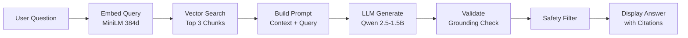

<p align="center">
  
  
  
  
</p>

<h1 align="center">🏥 MediVault</h1>

<p align="center">
  <strong>Your Medical Documents. Your Device. Your Privacy.</strong>
</p>

<p align="center">
  A privacy-first iOS application that brings the power of AI to your personal medical records—<br/>
  <strong>100% offline, zero data leaves your device.</strong>
</p>

---

## 🎯 What is MediVault?

MediVault is a **fully on-device Retrieval-Augmented Generation (RAG) system** designed for personal medical document management. Scan your prescriptions, lab results, and medical records, then ask questions in natural language—all powered by AI running entirely on your iPhone.

> **"What was my blood pressure at my last checkup?"**  
> **"Show me my cholesterol levels over time."**  
> **"What medications was I prescribed in January?"**

MediVault retrieves relevant information from your scanned documents and generates accurate, cited answers—without ever connecting to the internet.

---

## ✨ Key Features

| Feature | Description |
|---------|-------------|
| 🔒 **100% Offline** | No network calls, no cloud storage, no telemetry. Your medical data never leaves your device. |
| 📷 **Smart Document Scanning** | Scan multi-page documents using your camera with automatic edge detection. |
| 🖼️ **Photo Import** | Import existing photos of medical documents from your library. |
| 🧠 **On-Device AI** | Powered by Qwen 2.5-1.5B running locally via llama.cpp—no API keys needed. |
| 🔍 **Semantic Search** | Find information using natural language, not keywords. Ask questions like you would ask a doctor. |
| ✅ **Grounded Answers** | Every response is validated against your actual documents with cited sources. |
| 🛡️ **Medical Safety Guardrails** | The AI is explicitly designed to never provide medical diagnoses or treatment advice. |
| 💬 **Multi-Turn Conversations** | Context-aware follow-up questions for deeper exploration of your records. |

---

## 🏗️ Architecture

MediVault implements a complete **RAG pipeline** optimized for mobile:

```
┌─────────────────────────────────────────────────────────────────────┐
│                        MediVault Architecture                       │
├─────────────────────────────────────────────────────────────────────┤
│                                                                     │
│   📱 UI Layer (SwiftUI)                                             │
│   ├── ChatView          - Conversational interface                  │
│   ├── DocumentsTab      - Document management                       │
│   └── ScannerView       - VisionKit document capture                │
│                                                                     │
│   🧠 RAG Orchestrator                                               │
│   ├── EmbeddingService  - CoreML MiniLM (384-dim vectors)           │
│   ├── VectorStore       - SQLite + cosine similarity search         │
│   ├── Phi4MiniService   - Qwen 2.5-1.5B via llama.cpp               │
│   ├── PromptBuilder     - Context-aware prompt engineering          │
│   ├── GroundingValidator- Claim verification against sources        │
│   └── SafetyFilter      - Medical safety guardrails                 │ 
│                                                                     │
│   📄 Ingestion Pipeline                                             │
│   ├── VisionOCRService  - Apple Vision accurate text recognition    │
│   └── TextChunker       - Semantic chunking with overlap            │
│                                                                     │
└─────────────────────────────────────────────────────────────────────┘
```

### Query Flow



---

## 🚀 Getting Started

### Prerequisites

- **Xcode 26.2+**
- **iOS 26.2+ device** (iPhone only, simulator not recommended due to ML models)
- **~1GB storage** for models
- **Hugging Face CLI** for model download

### Installation

1. **Clone the repository**
   ```bash
   git clone https://github.com/yourusername/MediVault.git
   cd MediVault
   ```

2. **Download the LLM model** (~986MB)
   ```bash
   mkdir -p MediVault/Resources/Models
   
   hf download \
     enacimie/Qwen2.5-1.5B-Instruct-Q4_K_M-GGUF \
     "qwen2.5-1.5b-instruct-q4_k_m-00001-of-00001.gguf" \
     --local-dir MediVault/Resources/Models/
   ```
   
   > 💡 **Tip:** Install Hugging Face CLI with `pip install huggingface_hub`

3. **Open in Xcode**
   ```bash
   open MediVault.xcodeproj
   ```

4. **Build and run** on your iOS device

### First Launch

On first launch, MediVault will:
1. Load the CoreML embedding model
2. Initialize the SQLite vector database
3. Load the Qwen LLM into memory

This may take 15-30 seconds depending on your device.

---

## 📱 Usage

### Scanning Documents

1. Navigate to the **Documents** tab
2. Tap **Scan Document** to use your camera, or **Import from Photos** for existing images
3. The app will:
   - Extract text using OCR
   - Split into semantic chunks
   - Generate embeddings
   - Store in the local vector database

### Asking Questions

1. Navigate to the **Chat** tab
2. Ask any question about your medical history
3. View the AI's response with:
   - **Confidence indicator** (green/orange/red)
   - **Source count** showing how many documents were referenced
   - **Sources button** to view the exact text snippets used

### Example Queries

- *"What was my hemoglobin level?"*
- *"When was my last vaccination?"*
- *"Summarize my visit to Dr. Smith"*
- *"What medications am I currently taking?"*

---

## 🛠️ Tech Stack

| Component | Technology | Purpose |
|-----------|------------|---------|
| **UI Framework** | SwiftUI | Declarative, modern iOS UI |
| **State Management** | `@Observable` | Swift 5.9+ observation framework |
| **Concurrency** | Swift Actors | Thread-safe services |
| **Database** | [GRDB.swift](https://github.com/groue/GRDB.swift) | SQLite with Swift-native API |
| **Embeddings** | CoreML + MiniLM | 384-dimensional text vectors |
| **Tokenization** | [swift-transformers](https://github.com/huggingface/swift-transformers) | HuggingFace tokenizers |
| **LLM Inference** | [swift-llama-cpp](https://github.com/pgorzelany/swift-llama-cpp) | Optimized on-device inference |
| **OCR** | Apple Vision | Accurate text recognition |
| **Document Scanning** | VisionKit | Native camera-based scanning |

---

## 🔐 Privacy & Security

MediVault is designed with **privacy as the foundational principle**:

| Aspect | Implementation |
|--------|----------------|
| **Data Storage** | All data stored locally in app sandbox |
| **Network Access** | Zero network calls—completely offline |
| **ML Inference** | All models run on-device using CoreML and llama.cpp |
| **Medical Safety** | AI explicitly cannot provide diagnoses or treatment advice |
| **No Analytics** | No telemetry, no crash reporting, no user tracking |

> ⚠️ **Disclaimer:** MediVault is a document retrieval tool, not a medical device. Always consult healthcare professionals for medical decisions.

---

## 🧪 Technical Highlights

### Embedding Pipeline
- **Model:** MiniLM-L6 (float16 CoreML)
- **Dimensions:** 384
- **Sequence Length:** 128 tokens
- **Compute:** CPU/GPU/Neural Engine

### LLM Configuration
- **Model:** Qwen 2.5-1.5B Instruct (Q4_K_M quantization)
- **Context:** 4096 tokens
- **Batch Size:** 256
- **Output:** Structured JSON with citations

> 💡 **Model Evolution:** Initially developed with **Phi-3 Mini 3.8B (4-bit)**, later migrated to **Qwen 2.5-1.5B** for improved performance on medical terminology and better structured JSON output compliance.

### Vector Search
- **Algorithm:** Brute-force cosine similarity (optimized with Accelerate)
- **Threshold:** 0.5 minimum similarity
- **Results:** Top 3 most relevant chunks

### Text Chunking
- **Chunk Size:** 500 characters
- **Overlap:** 50 characters
- **Boundary Detection:** Sentence-aware splitting

---

## 📂 Project Structure

```
MediVault/
├── App/
│   └── MediVaultApp.swift          # App entry point
├── Features/
│   ├── Chat/                       # Conversational UI
│   ├── Embedding/                  # CoreML embedding service
│   ├── Generation/                 # LLM inference
│   ├── Home/                       # Tab navigation
│   ├── Ingestion/                  # OCR & document import
│   ├── RAG/                        # Core AI orchestration
│   │   ├── Grounding/              # Answer validation
│   │   ├── Orchestrator/           # Query coordination
│   │   ├── Prompt/                 # Prompt engineering
│   │   ├── Protocols/              # Service interfaces
│   │   └── Safety/                 # Medical guardrails
│   └── VectorDB/                   # Vector storage
├── Resources/
│   └── Models/                     # ML models (see setup)
└── Assets.xcassets/                # App assets
```

---

## 🗺️ Roadmap

- [ ] iPad support with split-view
- [ ] Document categories and tagging
- [ ] Export reports as PDF
- [ ] Apple Watch companion for quick queries
- [ ] Multi-language OCR support
- [ ] iCloud backup (encrypted)

---

## 🤝 Contributing

Contributions are welcome! Please feel free to submit a Pull Request.

1. Fork the project
2. Create your feature branch (`git checkout -b feature/AmazingFeature`)
3. Commit your changes (`git commit -m 'Add some AmazingFeature'`)
4. Push to the branch (`git push origin feature/AmazingFeature`)
5. Open a Pull Request

---

## 📄 License

This project is licensed under the MIT License - see the [LICENSE](LICENSE) file for details.

---

## 🙏 Acknowledgments

- [GRDB.swift](https://github.com/groue/GRDB.swift) - A toolkit for SQLite databases
- [swift-transformers](https://github.com/huggingface/swift-transformers) - Swift implementation of HuggingFace tokenizers
- [swift-llama-cpp](https://github.com/pgorzelany/swift-llama-cpp) - Swift bindings for llama.cpp
- [Qwen](https://github.com/QwenLM/Qwen) - The Qwen team for the open-source LLM

---

<p align="center">
  <sub>Built with ❤️ for privacy-conscious healthcare</sub>
</p>
